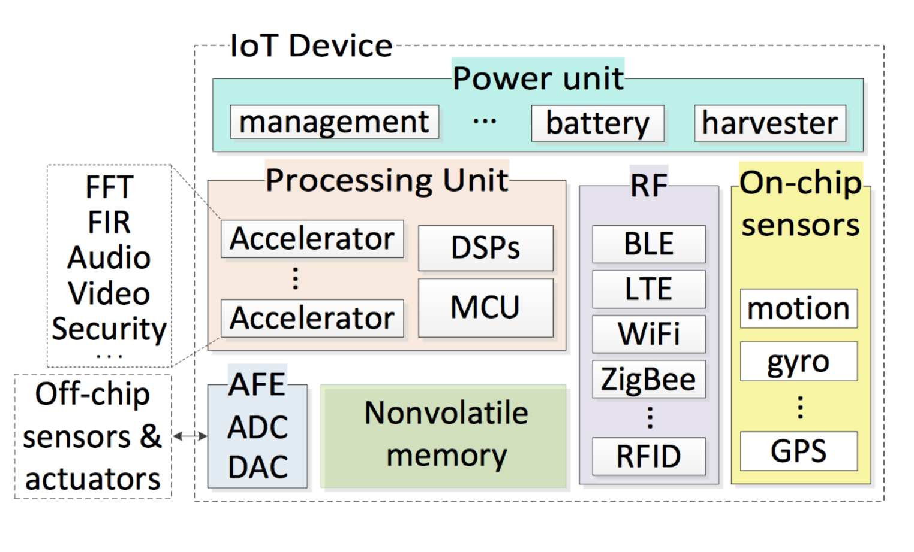

# Introduction to IoT
## What is IoT
An IoT smart object is characterized by being able to
* Sense
* Compute
* Communicate
* Uniquely Identified

We add small computers to everyday objects (things) and transform them into smart objects.  

IoT is a system of **Smart Objects (Things)** with **unique identifiers** and the **ability to transfer** data over a network without requiring human-to-human or human-to-computer interaction. 
## General Architecture of an IoT Device

## Smart Object in IoT
* Have limited functions
* Not useful by themselves
* Connected by low-capacity network
* Do not have proper UI
* Device count outnumber human.
* Interact with the physical world

## Flow of Data in IoT
* Sensors -> Local Processing -> Local Storage -> Network -> Internet -> Cloud Processing -> Cloud Storage
* The edge solutions could be
    * **Memoryless & Short Cycle**: Data is sensed and fused and be computed. An action is actuated based on the computation, and data is disregarded.
    * **With memory & Short Cycle**: Data is sensed in regular/irregular intervals and stored locally. The data is fused and computeted. An action is actuated based on the computation.
    * **With memory and Long Cycle**: Local sensing, processing, and actuation happens as before. Processed data is communicated to the cloud service. Sensed data is analyzed and prediction could be made. Feedback is sent back to improve services. Data history is stored.

## IoT and Big Data
* Big data will be generated from IoT devices. These data will migrate to different computing layers which are **Device, Gateway, Fog, Cloud**.
* Depending on your system objective and specification, you might want to change where the computing takes place.

## Where to Compute?
* Device centric
    * Microcontroller could do the computations.
    * Challenges: scarce computational resource
* Gateway centric
    * Gateway devices have more computational power and are used to connect with different networks and internet.
    * Challenges: guarantee the availability and deadline constraints.
* Fog centric
    * Fogs provide more computational power compared to IoT and has less latency compared to the cloud.
* Cloud centric
    * massive data storage volume, huge processing resources.
    * Challenges: high energy cost, latency, availability, scalability.

## Fog Computing
* A middle layer between the cloud and the hardware to enable more efficient data processing, analysis and storage. 
* Reduces the amount of data needing to travel to the cloud.
* Accessed through **local area network**.

## Cloud Computing
* Accessed through the internet.
* Has the most latency.

## Traditional Internet VS. IoT
| **Topic** | **Traditional Internet** | **The Internet of Things (IoT)** |
| --------- | ------------------------ | -------------------------------- |
| Who creates content | Human | Machine |
| How is the content consumed? | By request | By pushing information and triggering actions |
| How is the content combined? | Using explicitly defined links | Through explicitly defined operators |
| What is the value? | Answer questions | Action and timely information |
| What was done so far? | Both content creation and content consumption | Mainly content creation |

## Future Goal: Ambient Intelligence
* Device work in concert to support people in carrying out their everyday activities.
* The technology disappears into our surroundings until only the user interface remains perceivable by users.