# Digital Communication Protocols

To read digital sensors you need to use the sensor's **interface protocols**.

Interface Protocol could be **Serial** or **Parallel**.

Interface Protocols could be **Synchronous** or **Asynchronous**.

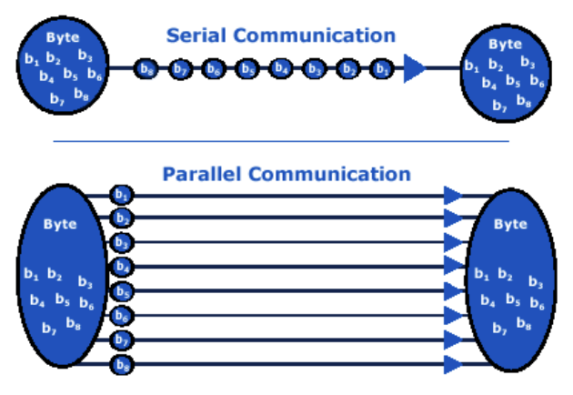
## Parallel Interface
* Transfer multiple bits at a time.
* Require a group of wires, also called the  **bus**
* Higher performance. 
* Requires many IO pins.
* Easier to implement because you don't need to process the bits.

## Serial Interface
* Transfer a single bit at a time.
* Requires a single wire.
* Higher overhead.
* Lower performance.
* Requires a single or few lines.

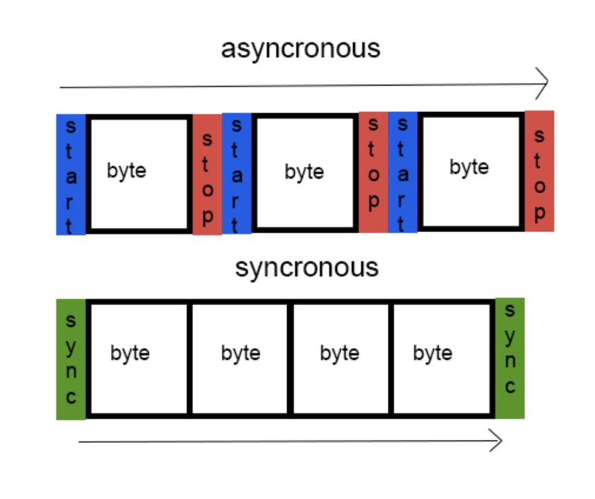

## Asynchronous Communication
* Doesn't need a clock.
* Need less wires (no clock).
* Usually slower transfer.
* More difficult implementation; need to send data in predefined format.
* EX: TTL, RS32

The following format is common:
* Start bit
* Data bits
* Parity bit
* Stop bits

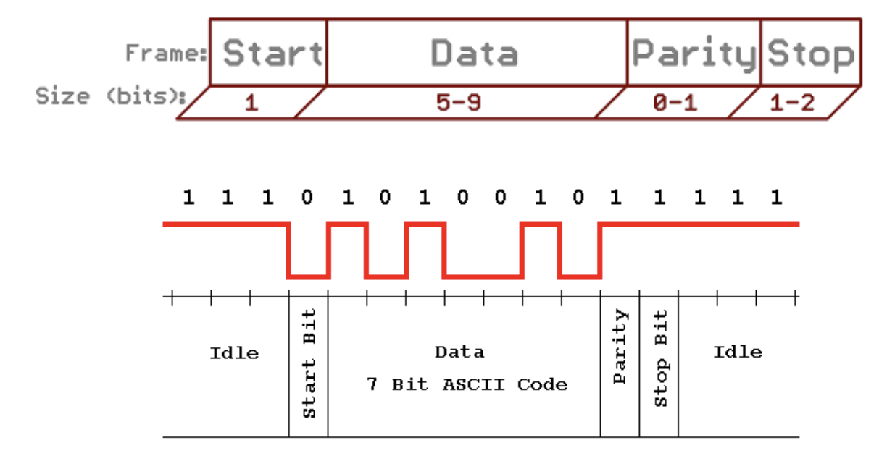

### Baud Rate
* Baud rate: how many times a signal changes per second. Measured in bits per second (bps).
* Bit rate: how many bits can be sent per second.
* bit rate = baud rate * $log_2(Total \space Signal \space Level)$
* To represent number in [Upper, Lower], use $\lceil log_2[Upper - Lower] \rceil$ to get the needed bits.
### Big Endian vs Little Endian
* Little Endian: LSB in smallest memory address. LSB is sent and received first.
* Big Endian: MSB in smallest memory address. MSB is sent and received first.

### Parity

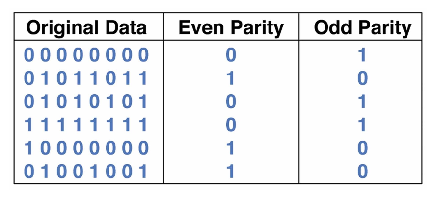
* Generate the parity bit by cascaded or parallel XOR.

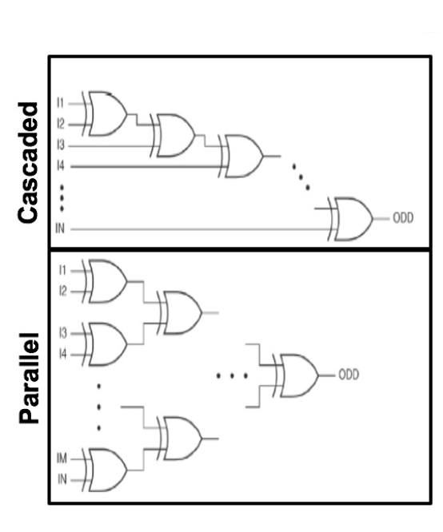

* How to dynamically change the odd or even parity? **XOR**

### Connecting Asynchronous Devices
* Connect TX to RX
* **Shared common ground** to ensure the concept of 0 and 1 is the same for both sides.
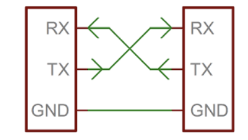
* We could only send 5 - 9 bits because of clock synchronization issue.

### Full and Half Duplex
* **Full-Duplex**: both devices can send and receive data simultaneously.
* **Half-Duplex**: devices should take turn in trnasmitting data.

### Example: UART
* Universal Asynchronous Receiver/Transmitter.
* Intermediate between parallel and serial data.
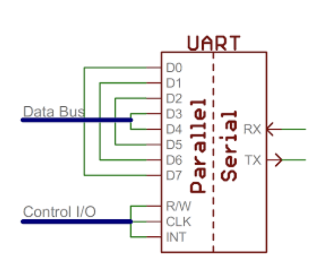

### Problems with Asynchronous Communication
* Tx and Rx should agree prior to data transfer on **baud rate**
* More complicated to decode the data.

## Synchronous Communication
* All sides uses a shared Clock.
* Pairs its data line(s) with a clock signal.
* Small packet ensures clock synchronization
* Faster serial transfer.
* Easier to implement.
* EX: SPI, I2C

### Example 1: SPI
* Separate data and clock wires
* Full Duplex synchronous protocol.
* Data is read on rising or falling edge of clock
* Clock and data are send at the same time, so no need pre-arranged baud rate.
* Receiver could be a shift register.
* Clock is generated by Master, but both master and slave can receive and transfer data.
* One master with multiple slaves.

#### SPI Data Exchange
* **MOSI**: Master out slave in; send data from master to slave.
* **MISO**: Master in Slave out; send data from slave to master.

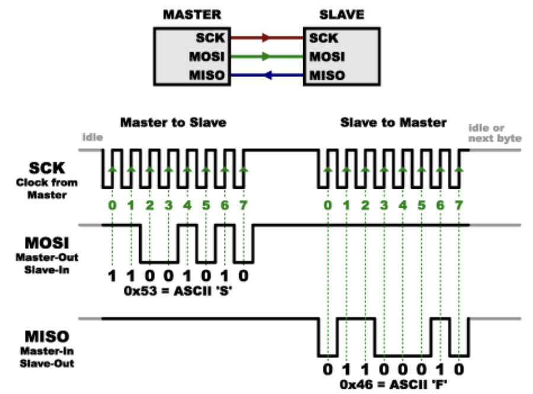

Need to pre-arrange the number of needed clock cycles.

#### SPI Slave Select
* Slave Select (SS) or Chip Select (CS) is used to select the slave node that SPI communicate with.
* Two ways to connect multiple slaves:
    * Direct: data is directly transferred to the target.
    * Daisy Chain: data flow through many slaves to reach target.

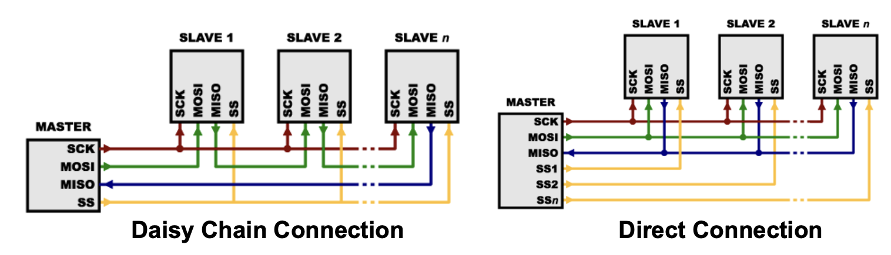

### Example 2: I2C
* Requires two wires:
    * **SDA**: data signal.
    * **SCL**: clock signal.
* Can have multiple master, but the current one generates the SCL.
* Slaves cannot generate the clock, but can force the clock down to prevent data transfer.
* Ackowledge takes 1 bit. Message size will be tested.
* Each signal line has a pull up resistor to pull up the wire.
    * Larger resistors for short distances (2 - 3m), smaller resistor for long distances (> 3m).

### I2C Device Addressing
* **Start Condition**: the SDA line switches from a high voltage level to a low voltage level **before** the SCL line switches from high to low.
* **Address Frame**: a 7 or 10 bit sequence unique to each slave that identifies the slave when the master wants to talk to it.
* **Read / Write Bit**: A single bit specifying whether the master is sending data to the slave(low voltage level) or requesting data from it (high voltage level)
* **ACK/NACK Bit**: each frame in a message is followed by an acknowledge.no-acknowledge bit. If an address frame or data frame was sucessfully received, an ACK bit is returned to the sender from the receiving device.
* **Stop Condition**: the SDA line switches from a low voltage level to a high voltage level **after** the SCL line switches from high to low.

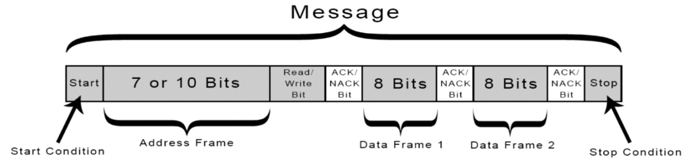

The slave compares the address sent from the master to its own address. If matches, the slave returns an ACK bit by pulling SDA line low for one bit.

If doesn't match the slave's own address, the slave leaves the SDA line high.

Data transfer is initiated with **SDA being pulled low while SCL stays high**. This condition **does not happen again during the data transfer**.
A stop bit is signaled when **SDA is pulled high while SCL is high** 

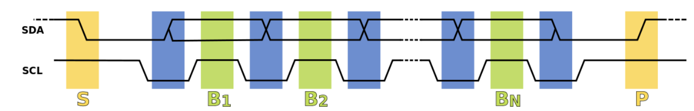

## Power Consumption
Compare sending a byte with UART and I2C

UART loses when transmitting >= 10 bytes
UART has the start and stop bits in every packet, but I2C has them at the beginning and end once.