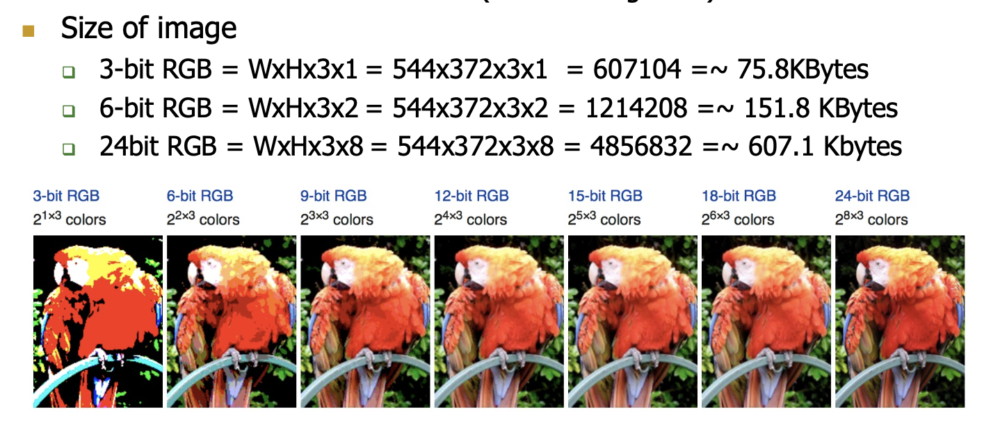

# Signals and Systems
Signal carries information in **Time** and **Frequency**, and a spectrum represents a signal in frequency domain.

We could sample the signals amplitude at a time. The more levels of amplitudes we could sample and the more time intervals we could sample lead to a more accurate sample.

## Time Sampling (discrete-time signals)
$F = frequency \space of \space sampling$

$T = sampling \space period$

$F = \frac{1}{T}$

Higher sampling rate leads to higher **accuracy** and **power consumption**

**Nyquist-Shannon Theorem**: given a function x(t) with no frequencies higher than B hertz,
the sampling frequency must be at least 2B. Otherwise, a wrong waveform could be sampled.

## Signal Quantization
**Quantization** is the process of constraining an input from a continuous or otherwise-;arge set of values (such as the real numbers) to a discrete set.

Numbers of quantization bits defines the accuracy of signal estimation.

## Image as a 2-D Signal
In an RGB (red, green, blue) image, there are 3 matrix layers

To calculate the number of pixels in an RGB image, multiply the width and height in pixel unit and multiply them by 3.

To calculate the total bits of the image, multiply the number of bits for each pixel by the total number of pixels.

