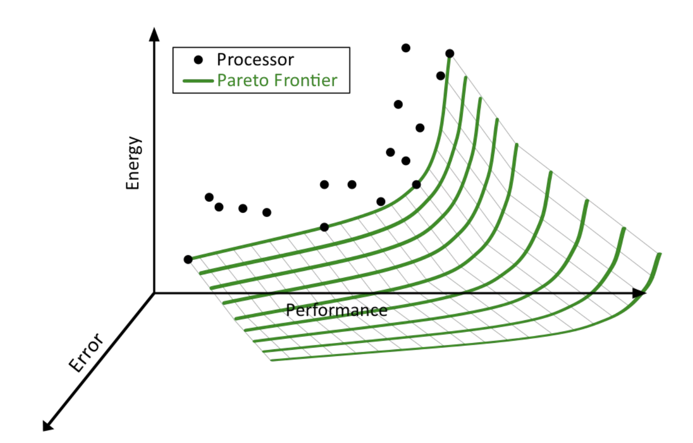
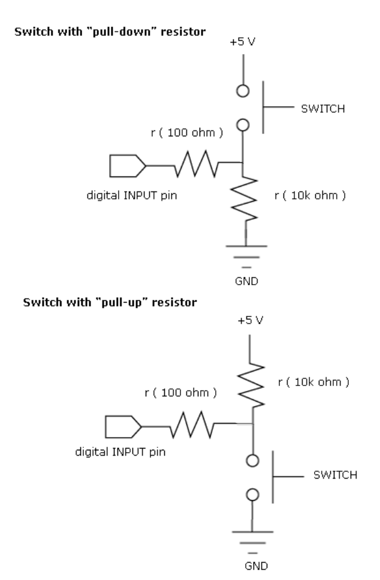

# Analog Sensing

## Approximate Computing
Approximate computing is a computation that returns a possibly inaccurate result rather than a guaranteed accurate result, for a situation where an approximate result is sufficient.

The following image depicts the Pareto Frontier, which are lines that defines the performance/energy lower limit that a program above it could achive. Approximate computing could act like the third variable, Error, and shift the Frontier down.

Use tolerable error to
* reduce the size of memory
* reduce number of memory accesses
* reduce energy consumption
* Improve performance

## Measuring Analog
* **Voltage divider** and measure the middle node in most cases
* Minimize readout errors by averaging multiple samples.

* $V_{out} = {\large \frac{R_2}{(R_1 + R_2)}} * V_{supply}$

## Button
Button is an analog sensor

## Button Debounce (Important)
When you push the switch, it bounces between in-contact and not in contact before fully closed. Therefore, signal bounces initially.

Solutions:
* Read more values and average them (analog solution)
* Use a debouncer after it's converted to digital input
    * RC based: Implemented with RC filter
    * SR based: Implemented with SR flipflop

## Potentiometer
A potentiometer, informally a pot, is a three-terminal resistor with a sliding or rotating contact that forms an adjustable voltage divider.

## Photoresistor, Temperature Sensor, Gas Sensor, Distance Sensor
* A light-controlled variable photoresistor has resistance decreases with increasing incident light intensity.
* A temperature sensor are thermally sensitive resistors who exhibit a predictable and precise change in electrical resistacne when the temperature varies.
* Gas sensor
* Distance Sensor employs ultrasonic technology that sends a pulse and calculate the time taken for it to reflect black

## Microprocessor Commands
* analogRead()
    * converts the input voltage range, 0 to 5 volts, to a digital value between 0 and 1023.
* delay(variable):
    * processor busy wait for the duration specified by variable
* digitalWrite():
    * writes a HIGH(1,5V) or LOW(0,0V) to a digital pin.

