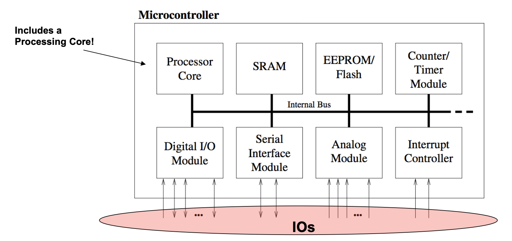
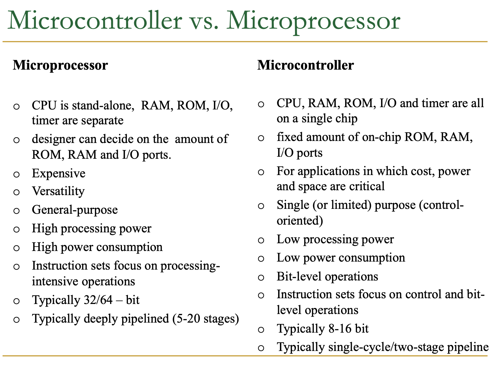
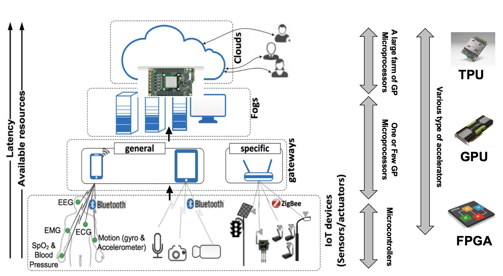

# Microcontroller
## Basic Design
* An **internal bus** connects all components.
* All components are **integrated on one chip**
* Communicate to outside world via IOs.

## Inside a Microcontroller
* **Processor Core**
* **Memory**
* **Interrupt Controller**
    * Interrupting the normal program flow in case of external or internal events.
    * When combined with sleep modes, they help to conserve power.
* **Timer/Counter**
    * Used to timestamp events, measure intervals, or count events
* **Digital and Analog I/O**
* **Interfaces**
    * For communication with PC.
    * Examples include SPI and I2C. May also contain USB or Ethernet.
* **Watchdog Timer**
    * Used to reset the controller in case of software crash.
    * restart when count goes to 0. Everytime when getting to the checkpoint, reset the count.
    * If for some reason the count goes to 0, something wrong happened and the program restarts.

## Microcontroller Architecture
* **Instruction Set**
    * RISC - Reduced Instruction Set Architecture - Low CPI but high IC
    * CISC - Complex instruction Set Architecture - High CPI but low IC
* **Memory** 
    * Von Neumon has one memory for instruction and data, and you cannot access data and instruction at the same time in Von Neumon architecture.
    * Harvard machine stores instruction and memory separately.

## Microcontroller vs. CPU

## Computation Layer
