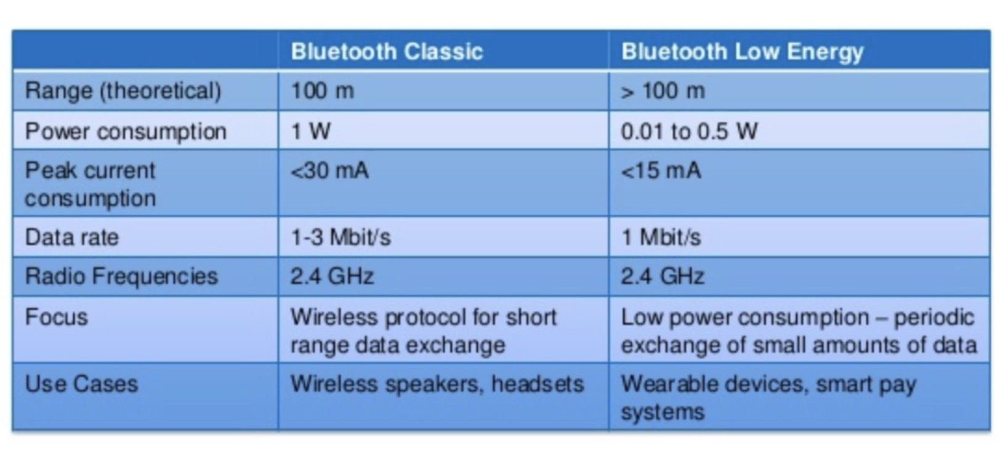
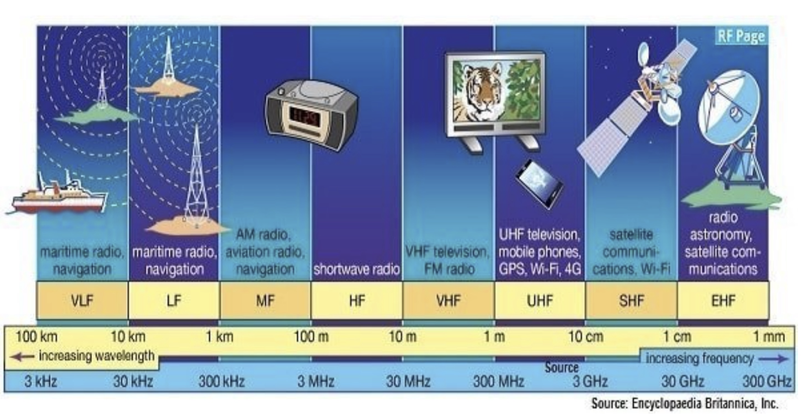
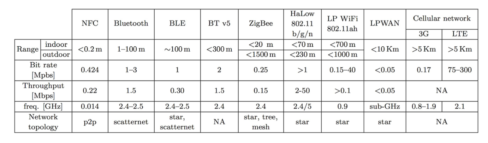
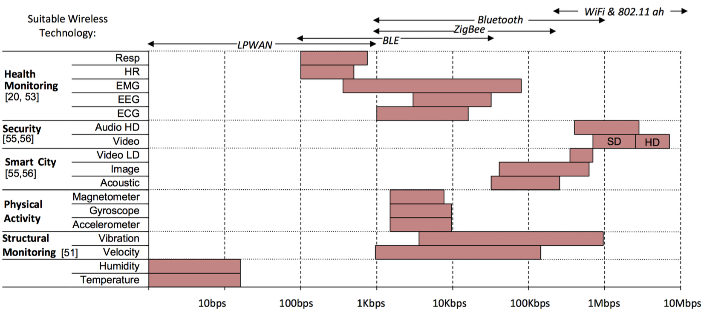
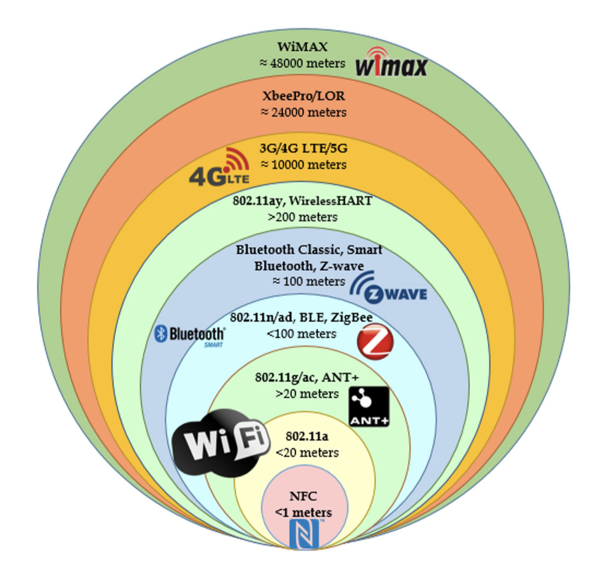

# MCU to Gateway
## Why Gateway?
* Lowering Power Consumption of the Sensor
* Supporting verying to/from sensor communication protocols
* Filtering the data
* Reduce Latency
* Improve Security
* IoT device connects to the gateway through non-IP networks, which consumes less power and offer larger mobility.

## NFC
* Short-range: 4 ~ 20 cm
* Low-speed connection
* Can be read-only
* Can be rewritable
* Usage: contactless payment systems, sharing contacts.
* Full-Duplex: able to transmit and receive data at the same time.

### Modes of Operation
* Passive
    * The initiator device provides a carrier field.
    * The target device answers by modulating the existing field.
    * The target device may draw its operating power from the field, making the target device a **transponder**
* Active
    * Both initiator and target device communicate by alternately generating their own fields.
    * Both have power supplies.
### NFC Security Problems
* No protection against eavesdropping.
* The theft forwards the request of the payment reader to the victim and relay victim's answer to another payment reader in real time pretending to be the owner of the victim's payment card.

## Classic Bluetooth
* High throughput and bandwidth
* Limited number of nodes in the networ (up to 7 slaves)
## BLE
* Lower power consumption
* Lower setup time
* supports unlimited number of nodes.

## ZigBee
* Small-size
* low cost
* low-power
* wide transmission range
* Symmetric encryption key (advantage over asymmtric is faster speed)
* Establish communication with asymmtric encryption then use symmtric encryption.
* Mesh and Tree networks can transmit data over long distances by passing data through a network of intermediate devices to reach further distant.
* Suitable for low data rate applications that require long battery life and secure networking.

## Wireless Fidelity (WiFi)
Wi-Fi is a technology for wireless local area networking (WLAN).

Most commonly uses the 2.4 GHz and 5 GHz radio bands.

Widely adopted for
* Internet access
* City-wide Wi-Fi
* Campus-wide Wi-Fi

Range of about 20 meters (66 feet) indoors and a greater range outdoors.

### Conventional WiFi
* High bandwidth
* High energy consumption
* Unsuitable for ultra-low-power IoT devices.

### Low-power WiFi 
* Extend the range of transmission
* Less data rate
* Lower power consumption
* Less interference with existing wireless networks

## Cellular Network
A cellular network is a communication network where the last link is wireless.

The network is **distributed over** land areas called **cells**

Each cells use a **different set of frequencies** from neighboring cells to avoid interference and to provide guaranteed service quality within each cell.

Cellular networks offer:
* **More capacity** than a single large transmitter
* Mobile devices use **less power** than with a single transmitter or satellite because the cell towers are closer.
* **Larger coverage** area than a sngle transmitter. Additional cell towers can be added indefinitely.

For IoT:
* Provide reliable high-speed connectivity to the internet.
* **BUT higher power consumption**
* **CANNOT do MCU to MCU**

## Low Power Wide Area Network (LPWAN)
* Suited for **low power** applications with very long range transmission.
* Support up to **10 km distance** between end-nodes and gateway.
* **Very low data rate.**

* Operates in **sub-GHz bands**, and no globally available band for LPWAN in sub-GHz.

## Summary
The communication technology should be chosen based on: 
* **Area** constrain (Area to implement the protocol)
* **Power** constrain (Range of broadcast)
* **Performance** constrain (Data transimission rate)
* **Noise** and interference

### How Data Rate Determines the Protocol?

### How Data Range Determines the Protocol?

## Timing of Data Transmission
### Continuous
* Send or receive data continuously
* EX: real-time systems such as health monitoring.
### Sporadic
* device collects and stores the data.
* transmits data whenever the connection is available.
### On-demand
* **User driven**: IoT device can be requested by the operator to send the collected data.
* **Even driven**: Communication is done once a specific event happens.

