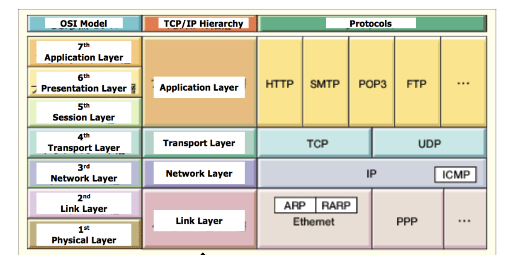
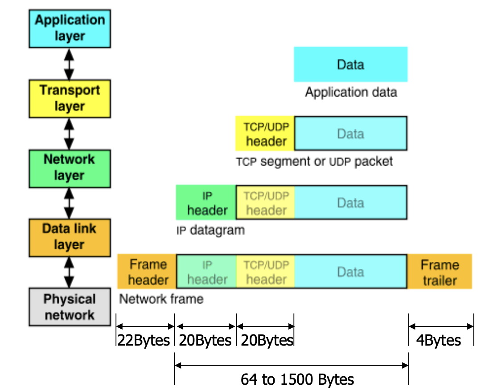
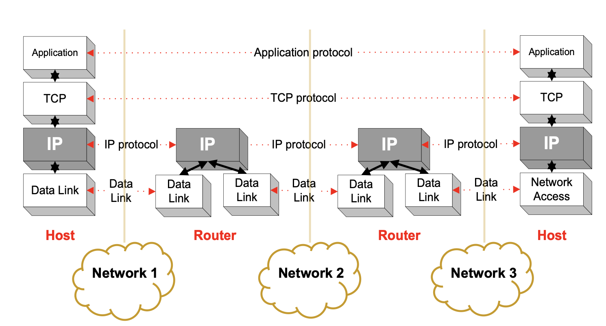
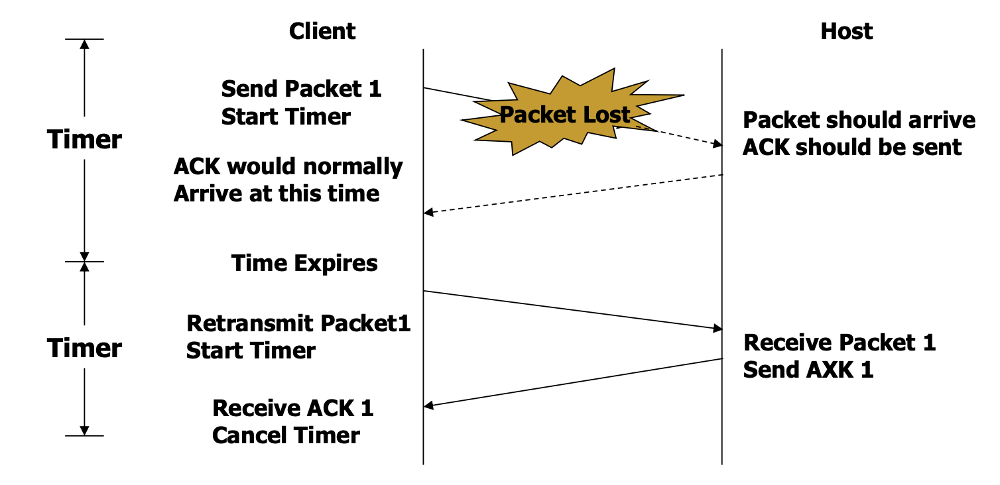

# IP Communication
Gateway removes the need for direct connection to internet.
* IoT devices can also connect locally through non-IP networks.
* Consume less power and offer larger mobility, and connect to the Internet via a gateway.

## Internet
* A set of interconnected networks.
* TCP / IP is what links them.
* It's a **distributed system** with no central control.
* Communication Links
    * Fiber, copper, radio, satellite.
* **IP** is the glue that connects all these devices.

## Routers
* Router are devices on multiple networks that pass traffic between them.
* Individual networks pass traffic from one router or endpoint to another

## TCP/IP Network Model
A layered Protocol:
* Layer 1: **Link**: includes device driver and network interface card.
* Layer 2: **Network**: handles the movement of packets, routing.
* Layer 3: **Transport**: provides a reliable flow of data between two hosts.
* Layer 4: **Application**: handles the details of the particular application.

The data is sent down the protocol stack.
Ech layers adds to the data the required header.

## Routing
* All devices need to know what IP addresses are on directly attached networks.
* If the destination address is local, send it directy there.
* If the destination address isn't local, send the packet to a local router and the router routes it to possible IP addresses.

## UDP (User Datagram Protocol)
* A thin layer on top of IP.
* Source and destination ports.
* Unreliable: duplication, loss, out-of-order receiving of packets are possible.

## TCP (Transmission Control Protocol)
* Reliable alternative of UDP with **more overhead**.
* A thick layer (as opposed to UDP) on top of IP.
* **Reliable Delivery:** data is guaranteed to arrive, and in the correct order without duplications.

## TCP Implementation
* Data is divided up into packets by the operating system.
* Packets are numbered, and received packets are acknowledged.

